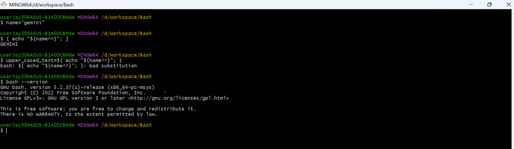

# CH11 -- shell expansions
## objectives
You will know

    + brace expansion
    + tilde expansion
    + parameter and variable expansion
    + command substitution
    + arithmetic expansion
    + process substitution
    + word splitting
    + filename expansion
    + quote removal
    + precedence of these expansions

## CH11-1 -- precedence of these expansions

The precedence from highest to lowest are as follows

    + brace expansion
    + tilde expansion, parameter and variable expansion, arithmetic expansion (done in inside-to-outside fashion), command substitution (done in left-to-right fashion), process substitution (if system supports it)
    + word splitting
    + filename expansion
    + quote removal

## CH11-2 -- brace expansion
Given a sequence that is wrapped by `{}` and seperated by `,`,  it will perform brace expansions on the sequence,

generating a sequence of string by replacing each element in the string that contains the sequence that is used for brace expansions (i.e. contains `{}`).

### Examples
#### Example 1

`brace-expansion-example-1.bash`

```
echo a{d,c,b}e
```

In above example,

| sequence used for brace expansions | `n`th iteration | element | generated string  in `n`th iteration |
| :-- | :-- | :-- | :-- |
| `{d,c,b}` | 0 | `d` | `ade` |
| `{d,c,b}` | 1 | `c` | `ace` |
| `{d,c,b}` | 2 | `b` | `abe` |

combining them together will get a sequence of string

```
ade ace abe
```

Therefore,

```
a{d,c,b}e
```

will be expanded into

```
ade ace abe
```

And thus, executing this script will echo

```
ade ace abe

```

#### Example 2

```
mkdir -p project/{src,bin,doc}
```

In above example,

| sequence used for brace expansions | `n`th iteration | element | generated string  in `n`th iteration |
| :-- | :-- | :-- | :-- |
| `{src,bin,doc}` | 0 | `src` | `project/src` |
| `{src,bin,doc}` | 1 | `bin` | `project/bin` |
| `{src,bin,doc}` | 2 | `doc` | `project/doc` |

combining them together will get a sequence of string

```
project/src project/bin project/doc
```

Therefore,

```
mkdir -p project/{src,bin,doc}
```

is equivalent to

```
mkdir -p project/src project/bin project/doc
```

executing this script will create these folders respectively

    + `src` folder under `project` folder relative to current path
    + `bin` folder under `project` folder relative to current path
    + `doc` folder under `project` folder relative to current path

#### Example 3

```
echo {1..5}
```

In above example, the `1..5` will be expanded to `1,2,3,4,5`

Thus

```
echo {1..5}
```

is equivalent to

```
echo {1,2,3,4,5}
```

| sequence used for brace expansions | `n`th iteration | element | generated string  in `n`th iteration |
| :-- | :-- | :-- | :-- |
| `{1,2,3,4,5}` | 0 | `1` | `1` |
| `{1,2,3,4,5}` | 1 | `2` | `2` |
| `{1,2,3,4,5}` | 2 | `3` | `3` |
| `{1,2,3,4,5}` | 3 | `4` | `4` |
| `{1,2,3,4,5}` | 4 | `5` | `5` |

Therefore, it is equivalent to

```
echo 1 2 3 4 5
```

executing this script will echo

```
1 2 3 4 5

```

## CH11-3 -- tilde expansion
**`tilde-prefix` definition**

In case of a word begins with an unquoted tilde character (‘~’), all of the characters up to the first unquoted slash (i.e. `/` but execlusive to `'/'` and `"/"`) are considered a `tilde-prefix` (if exists), or all characters are considered as a `tilde-prefix`, if there is no unquoted slash.

for example,

| word | `tilde-prefix` | description |
| :- | :- | :-- |
| `~` | `~` | no first occurence of unquoated slash `/` |
| `~/workspace` | `~` | `/` at second char is the first occurence of unquoated slash `/` |
| `~current-directory/workspace` | `~current-directory` | `/` between `y` and `w` is the first occurence of unquoated slash `/` |
| `~current-directory/workspace/git` | `~current-directory` |  `/` between `y` and `w` is the first occurence of unquoated slash `/` |
| `~current-directory/workspace/git` | `~current-directory` |  `/` between `y` and `w` is the first occurence of unquoated slash `/` |
| `~~current-directory"/"workspace/git` | `~~current-directory"/"workspace` | `/` between `e` and `g` is the first occurence of unquoated slash `/`. Note that `"/"` bwteen `y` and `w` are quoated (by double quotations)  |
| `~~current-directory'/'workspace/git` | `~~current-directory"/"workspace` | `/` between `e` and `g` is the first occurence of unquoated slash `/`. Note that `"/"` bwteen `y` and `w` are quoated (by single quotations)  |
| `parent-directory/~current-directory/workspace/git` | `` | the word does NOT begin with `~` |

Only if a `tilde-prefix` does NOT contain any quotations (i.e. single quotation `'` or double quotations `"`) and backslash `\`, the tilde expansion will be validate.

In the format of

```
~{login-name}/
```

`{login-name}` is the string after the beginning tilde `~` of the `tilde-prefix`

Here if `{login-name}` is an empty string (i.e. **`tilde-prefix` is `~`**), 

then **`~` will be expanded into `$HOME`** (a kind of a system environment path variable)

| user inputs | `tilde-prefix` | `{login-name}` | perform tilde expansion or not | description | 
| :-- | :-- | :-- | :-- | :-- |
| `~` | `~` | `` | yes | your home directory |
| `~john/` | `~john` | `` | yes | john's home directory |
| `~"john"/` | `~"john"` | `"john"` | no | considered as an unexpaned string `~john/` |
| `~ /` | `~` | `` | `` | your home directory followed by a whitespace ` ` then root directory |

### system environment path variable
(If tilde-prefix exists) some of specific tilde-prefix will be expanded into a system environment path variable in Shell

| `tilde-prefix` | system environment path variable | description |
| :-- | :-- | :-- |
| `~` | `$HOME` | your home directory | 
| `~+` | `$PWD` | current working direcotry | 
| `~-` | `$OLDPWD` | old present working direcotry (previous working directory) |

### command
(If tilde-prefix exists) some of specific tilde-prefix will be expanded into a command in Shell

| `tilde-prefix` | command | description |
| :-- | :-- | :-- |
| `~N` | `dirs +N` | expanded as the `N`th of directory stacking trace from left to right | 
| `~+N` | `dirs +N` | expanded as the `N`th of directory stack from left to right | 
| `~-N` | `dirs -N` | expanded as the `N`th of directory stack trace from right to left | 

where

`N` is a nonnegative integer.

> [!NOTE]
> `dirs`: is a shorthand of *dir*ectory *s*tack, it will accessing the `N`th of directory stack (from left to right or from right to left) and expand the result.

> [!TIP]
> see CH16 for more details and usage

### Examples
#### Example 1
`tilde-expansion-example-1.bash`

```
main(){
    local home_directory=~
    echo "The current user home directory:\`$HOME\`"
    echo "The current user home directory:\`$home_directory\`"
}

main
```

executing this script will echo

```
$ source "D:\workspace\Bash\Bash tutorial\examples\shell expansions\tilde expansion\tilde-expansion-example-1.bash"
The current user home directory:`/c/Users/userJay30`
The current user home directory:`/c/Users/userJay30`

```

#### Example 2
`tilde-expansion-example-2.bash`

```
main(){
    local john_home_directory=~john
    local not_be_considered_as_john_home_directory=~"john"
    local your_home_directory_followed_by_a_whitespace="~ /"
    
    echo "The user john home directory:\`$john_home_directory\`"
    echo "\`$not_be_considered_as_john_home_directory\` will be NOT considered a home directory and Bash engine will NOT perform a tilde-expansion."
    echo "\`~ /\` will be considered a home directory and Bash engine will perform a tilde-expansion and it will be expanded to \`$your_home_directory_followed_by_a_whitespace\`"
}

main
```

executing this script will echo

```
$ source "D:\workspace\Bash\Bash tutorial\examples\shell expansions\tilde expansion\tilde-expansion-example-2.bash"
The user john home directory:`~john`
`~john` will be NOT considered a home directory and Bash engine will NOT perform a tilde-expansion.
`~ /` will be considered a home directory and Bash engine will perform a tilde-expansion and it will be expanded to `~ /`

```

#### Example 3
`tilde-expansion-example-3.bash`

```
main(){
    local your_home_directory=~
    local current_working_directory=~+
    local previous_working_directory=~-
    local yes_no_answer=""

    if [[ "$your_home_directory" == "$HOME" ]]; then
        yes_no_answer="yes"
    else
        yes_no_answer="no"
    fi

    echo "\`~\` will be expanded to \`\$HOME\`\`" 
    echo "Are \`$your_home_directory\` and \`$HOME\` equal after expansion? \`$yes_no_answer\`"
    echo ""

    if [[ "$current_working_directory" == "$PWD" ]]; then
        yes_no_answer="yes"
    else
        yes_no_answer="no"
    fi

    echo "\`~+\` will be expanded to \`\$PWD\`"
    echo "Are \`$current_working_directory\` and \`$PWD\` equal after expansion? \`$yes_no_answer\`"
    echo ""

    if [[ "$previous_working_directory" == "$OLDPWD" ]]; then
        yes_no_answer="yes"
    else
        yes_no_answer="no"
    fi

    echo "\`~-\` will be expanded to \`\$OLDPWD\`"
    echo "Are \`$previous_working_directory\` and \`$OLDPWD\` equal after expansion? \`$yes_no_answer\`"
    echo ""
}

main
```

Type these commands

```
userJay30@ASUS-B1400CBNGW MINGW64 ~ (master)
$ pwd
/c/Users/userJay30

userJay30@ASUS-B1400CBNGW MINGW64 ~ (master)
$ cd "D:\workspace\Bash\Bash tutorial"

userJay30@ASUS-B1400CBNGW MINGW64 /d/workspace/Bash/Bash tutorial
$ pwd
/d/workspace/Bash/Bash tutorial

userJay30@ASUS-B1400CBNGW MINGW64 /d/workspace/Bash/Bash tutorial
$ echo "$OLDPWD"
/c/Users/userJay30

userJay30@ASUS-B1400CBNGW MINGW64 /d/workspace/Bash/Bash tutorial
$ cd ../

userJay30@ASUS-B1400CBNGW MINGW64 /d/workspace/Bash
$ pwd
/d/workspace/Bash

userJay30@ASUS-B1400CBNGW MINGW64 /d/workspace/Bash
$ echo "$OLDPWD"
/d/workspace/Bash/Bash tutorial

```

Then executes this script will echo

```
userJay30@ASUS-B1400CBNGW MINGW64 /d/workspace/Bash
$ source "D:\workspace\Bash\Bash tutorial\examples\shell expansions\tilde expansion\tilde-expansion-example-3.bash"
`~` will be expanded to `$HOME``
Are `/c/Users/userJay30` and `/c/Users/userJay30` equal after expansion? `yes`

`~+` will be expanded to `$PWD`
Are `/d/workspace/Bash` and `/d/workspace/Bash` equal after expansion? `yes`

`~-` will be expanded to `$OLDPWD`
Are `/d/workspace/Bash/Bash tutorial` and `/d/workspace/Bash/Bash tutorial` equal after expansion? `yes`

```

## CH11-4 -- parameter and variable expansion
### capitalize and decapitalize
syntax: repsented by Regex

```
$\{{pattern_to_be_matched}({special_symbol}{1,2}){regex_pattern}?\}
```

where

`{pattern_to_be_matched}` is the pattern that will be matached by the pattern `{regex_pattern}` using Regex

`{regex_pattern}` is a pattern that can consist of alphabet letters and 

### Examples
#### Example 1
`parameter-expansion-example-1.bash`

```
main(){
    local v=123
    echo ${v-unset}
    echo ${v:-unset-or-null}
    unset v
    echo ${v-unset}
    unset
    v=
    echo ${v-unset}
    echo ${v:-unset-or-null}
}

main
```

executing this script will echo

```
123
123
unset

unset-or-null

```

#### Example 2
`parameter-expansion-example-2.bash`

```
main(){
    local var=123
    unset var
    : ${var=DEFAULT}
    echo $var   
    var=
    : ${var=DEFAULT}
    echo $var
    var=
    : ${var:=DEFAULT}
    echo $var
    unset var
    : ${var:=DEFAULT}
    echo $var
}

main
```

executing this script will echo

```
DEFAULT

DEFAULT
DEFAULT

```

#### Example 3
`parameter-expansion-example-3.bash`

```
main(){
    local var=123
    # sets v as empty string (which can be considered as NULL value)
    var=
    # performs a null or unset safetly check 
    # Since var is an empty string (which can be considered as NULL value) 
    # it throws an user-defined error 
    # `var: var is unset or null`
    # and thus NOT executing the following commands
    : ${var:?var is unset or null} 
    
    # performs an unset safetly check 
    # Since var is not unset
    # it will be expanded as the value of var 
    # and thus echoing empty string
    echo ${var?var is unset}

    # unsets v
    unset var
    : ${var?var is unset}

    # performs a null or unset safetly check 
    # Since var is an empty string (which can be considered as NULL value) 
    # it throws an user-defined error 
    # `var: var is unset or null`
    # and thus NOT executing the following commands
    : ${var:?var is unset or null}

    var=123

    # performs a null or unset safetly check 
    # Since var is neither an empty string (which can be considered as NULL value) nor unset, 
    # it will be expanded as the value of var 
    # and thus echoing `123`
    echo ${var:?var is unset or null}
}

main
```

executing this script will throw an user-defined error at line 10

```
$ "D:\workspace\Bash\Bash tutorial\examples\shell expansions\parameter expansion\parameter-expansion-example-3.bash"
D:\workspace\Bash\Bash tutorial\examples\shell expansions\parameter expansion\parameter-expansion-example-3.bash: line 10: var: var is unset or null

```

#### Example 4
This example illustrates how to get specific part of string (like `string.Substring` method in `C#`) 

`parameter-expansion-example-4.bash`

```
main(){
    local str=01234567890abcdefgh
    echo ${str:7}
    echo ${str:7:0}
    echo ${str:7:2}
    echo ${str:7:-2}
    echo ${str: -7}
    echo ${str: -7:0}
    echo ${str: -7:2}
    echo ${str: -7:-2}

    set -- 01234567890abcdefgh
    echo ${1:7}
    echo ${1:7:0}
    echo ${1:7:-2}
    echo ${1:7:2}
    echo ${1: -7}
    echo ${1: -7:0}
    echo ${1: -7:2}
    echo ${1: -7:-2}
}

main
```

executing this script will echo

```
7890abcdefgh

78
7890abcdef
bcdefgh

bc
bcdef
7890abcdefgh

7890abcdef
78
bcdefgh

bc
bcdef

```

#### Example 5
This example also illustrates how to get specific part of string (like `string.Substring` method in `C#`) 

`parameter-expansion-example-5.bash`

```
main(){
    arr[0]=01234567890abcdefgh
    echo ${arr[0]:7}
    echo ${arr[0]:7:0}
    echo ${arr[0]:7:2}
    echo ${arr[0]:7:-2}
    echo ${arr[0]: -7}
    echo ${arr[0]: -7:0}
    echo ${arr[0]: -7:2}
    echo ${arr[0]: -7:-2}
}

main
```

executing this script will echo

```
7890abcdefgh

78
7890abcdef
bcdefgh

bc
bcdef

```

#### Example 6
This example illustrates how to get specific part of all arguments that are set. 

`parameter-expansion-example-6.bash`

```
main(){
    set -- 1 2 3 4 5 6 7 8 9 0 a b c d e f g h
    echo ${@:7}
    echo ${@:7:0}
    echo ${@:7:2}
    echo ${@:7:-2}
    echo ${@: -7:2}
    echo ${@:0}
    echo ${@:0:2}
    echo ${@: -7:0}
}

main
```


executing this script will throw an error at line 6, terminating the script

```
$ "D:\workspace\Bash\Bash tutorial\examples\shell expansions\parameter expansion\parameter-expansion-example-6.bash"
7 8 9 0 a b c d e f g h

7 8
D:\workspace\Bash\Bash tutorial\examples\shell expansions\parameter expansion\parameter-expansion-example-6.bash: line 6: -2: substring expression < 0

```

#### Example 7
This example also illustrates how to get specific part of all arguments that are set. 

`parameter-expansion-example-7.bash`

```
main(){
    set -- 1 2 3 4 5 6 7 8 9 0 a b c d e f g h
    echo ${@:0}
    echo ${@:0:2}
    echo ${@: -7:0}
}

main
```

executing this script will echo

```
$ "D:\workspace\Bash\Bash tutorial\examples\shell expansions\parameter expansion\parameter-expansion-example-7.bash"
D:\workspace\Bash\Bash tutorial\examples\shell expansions\parameter expansion\parameter-expansion-example-7.bash 1 2 3 4 5 6 7 8 9 0 a b c d e f g h
D:\workspace\Bash\Bash tutorial\examples\shell expansions\parameter expansion\parameter-expansion-example-7.bash 1

```

#### Example 8
This example illustrates how to get specific range of an array

`parameter-expansion-example-8.bash`

```
main(){
    arr=(0 1 2 3 4 5 6 7 8 9 0 a b c d e f g h)
    echo ${arr[@]:7}
    echo ${arr[@]:7:2}
    echo ${arr[@]: -7:2}
    echo ${arr[@]: -7:-2}
    echo ${arr[@]:0}
    echo ${arr[@]:0:2}
    echo ${arr[@]: -7:0}
}

main
```


executing this script will throw an error at line 6, terminating the script

```
$ "D:\workspace\Bash\Bash tutorial\examples\shell expansions\parameter expansion\parameter-expansion-example-8.bash"
7 8 9 0 a b c d e f g h
7 8
b c
D:\workspace\Bash\Bash tutorial\examples\shell expansions\parameter expansion\parameter-expansion-example-8.bash: line 6: -2: substring expression < 0

```

#### Example 9
This example also illustrates how to get specific range of an array

`parameter-expansion-example-9.bash`

```
main(){
    arr=(0 1 2 3 4 5 6 7 8 9 0 a b c d e f g h)
    echo ${arr[@]:0}
    echo ${arr[@]:0:2}
    echo ${arr[@]: -7:0}
}

main
```

executing this script will echo

```
$ "D:\workspace\Bash\Bash tutorial\examples\shell expansions\parameter expansion\parameter-expansion-example-9.bash"
0 1 2 3 4 5 6 7 8 9 0 a b c d e f g h
0 1

```

## CH11-4 -- command substitution
### syntax and description
syntax:

Forms in newer version:

```
$({commands})
```

where

```
{commands}: one or more commands
```

2th form in latest version (ONLY supports on Bash 5.2+): 

> [!WARNING]
> this form is ONLY on Git Bash 5.2+ which is released in 2022-09-26.
> 
> Please check its version first.
> 
> Also, check your device is running on Ubuntu kernel (such as Unix/Linux) 
> 
> since the new cutting-edge feature is ONLY stable and fully supported on Ubuntu kernel.
>
> Take my experiment as example,
>
> My device is on Windows 11. And Git Bash terminal (with version Bash 5.2) runs on `MSYS2` ecosystem  (which uses `MingGW-64` -- `GCC` compiler),
>
> According my experiment,
>
> It is ONLY accepted that 
> 
> the statement ONLY has this form, that is
>
> It is NOT acceptable if one appends something on the command in this form
>
> For example, 
> 
> this is acceptable on Windows 11
>
>> [!DO]
>> 
>> ```
>> { echo "${name^^}"; }
>> ```
>
> while, running this example on Windows 11 will throw an error.
>
>> [!DON'T]
>> 
>> ```
>> upper_cased_text=${ echo "${name^^}"; }
>> ``` 
>
> see the following figure as example
>
> 

Represented with Regex

```
{dollar-sign}{left-curly-bracket}{c}?{whitespaces}{commands}{semicolon}{whitespaces}{right-curly-bracket}
```

where

```
{c}:= {whitespace}|{tab}|{newline}|{pipeline}
```

```
{left-curly-bracket}: left curly bracket `{`
{right-curly-bracket}: right curly bracket `}`
{dollar-sign}: dollar sign `$`
{whitespace}: a whitespace ` `
{tab}: a tab `\t`
{newline}: break line `\n`
{pipeline}: pipe line `|`
{semicolon}: semi-colon `;`
```

Form in older version (deprecated):

```
`command`
```

description:

+ About 1th form,

```
$({commands})
```

`$({commands})` will execute the commands `{commands}` and then will expand it to the result after executing.

For example

```
cat "file1.txt"
```

will display the file content of `file1.txt` on terminal

So,

```
FILE_CONTENT=$(cat "file1.txt")
```

will assign the file content of `file1.txt` into `FILE_CONTENT` variable.

+ About 2th form

```
{left-curly-bracket}{c}?{whitespaces}{commands}{semicolon}{whitespaces}{right-curly-bracket}
```

will look like this

```
{commands; }
```

or 

```
${| commands; }
```

and more

which will also expand it then execute it.

The only differece between

```
{commands; }
```

and 

```
${| commands; }
```

is that 

in latter, once after it is executed, the construct will expand it to the value of `RELPY` special variable,

while in former, it will not do so.


shorthand:

```
$(cat "file1.txt")
```

is equivalent to

```
$(< "file1.txt")
```

but the latter one runs faster since it is not needed to execute `cat.exe` file

### comparison
We will ONLY compare the 1th and 2th form.

Though they have the same behavior in a 

### Examples
#### Example 1
`command-substitution-example-1.bash`

```
# Get the directory where the current script is located 
SCRIPT_DIR="$( cd "$( dirname "${BASH_SOURCE[0]}" )" && pwd )"

main(){
    local file_name="$SCRIPT_DIR/../../../inputs/scripts/multiple-line-example-1.txt"
    local file_content=""
    cat "$file_name"
    
    file_content=$(cat "$file_name")
    echo "file content of the file named \`$file_name\`:"
    echo "$file_content"

    file_content=$(< "$file_name")
    echo "file content of the file named \`$file_name\`:"
    echo "$file_content"
}

main
```

inputs script:

`multiple-line-example-1.txt`

```
This is a multiple line
Hello C
Hello C++
Hello C#
Hello Bash
Hello Java
Hello GoLang
Hello Kotlin
```

Assuming that the script is located at `D:\workspace\Bash\Bash tutorial\examples\shell expansions\command substitution\command-substitution-example-1.bash`

and inputs script is located at `D:\workspace\Bash\Bash tutorial\inputs\scripts\multiple-line-example-1.txt`

Then executing this script will echo

```
$ source "D:\workspace\Bash\Bash tutorial\examples\shell expansions\command substitution\command-substitution-example-1.bash"
This is a multiple line
Hello C
Hello C++
Hello C#
Hello Bash
Hello Java
Hello GoLang
Hello Kotlinfile content of the file named `/d/workspace/Bash/Bash tutorial/examples/shell expansions/command substitution/../../../inputs/scripts/multiple-line-example-1.txt`:
This is a multiple line
Hello C
Hello C++
Hello C#
Hello Bash
Hello Java
Hello GoLang
Hello Kotlin
file content of the file named `/d/workspace/Bash/Bash tutorial/examples/shell expansions/command substitution/../../../inputs/scripts/multiple-line-example-1.txt`:
This is a multiple line
Hello C
Hello C++
Hello C#
Hello Bash
Hello Java
Hello GoLang
Hello Kotlin

```

#### Example 2
`command-substitution-example-2.bash`

```
function to_upper1(){
    local name="$1"
    local -n _perf=$2
    local result=""
    local start_time=$EPOCHREALTIME
    
    # 傳統寫法
    # 不會開啟一個subshell，效能較佳
    result=$(echo "${name^^}")     
    
    local end_time=$EPOCHREALTIME
    _perf=$(echo "$end_time - $start_time" | bc)

    echo "$_ref"
    echo "Time: $_perf s"
}

function to_upper2(){
    local name="$1"
    local -n _perf=$2
    local start_time=$EPOCHREALTIME
    
    # 新式寫法(僅支援Bash 5.2+，且在Unix/Linux環境下，執行時的預期結果比較穩定)
    # 不會開啟一個subshell，效能較好
    # NOTE：
    # { 之後加空格，指令後加分號，最後加空格與 }
    { echo "${name^^}"; }  
    
    local end_time=$EPOCHREALTIME
    _perf=$(echo "$end_time - $start_time" | bc)

    echo "Time: $_perf s"
}

function print_info(){
    local text="$1"
    local upper_cased_text=""
    local performance=""
    
    echo "text: \`$text\`"
    to_upper1 "$text" performance
    to_upper2 "$text" performance
}

main(){
    print_info "gemini"
}

main
```

executing this script will echo

```
$ source "D:\workspace\Bash\Bash tutorial\examples\shell expansions\command substitution\command-substitution-example-2.bash"
text: `gemini`

Time: .054128 s
GEMINI
Time: .000025 s

```

version info:

```
$ bash --version
GNU bash, version 5.2.37(1)-release (x86_64-pc-msys)
Copyright (C) 2022 Free Software Foundation, Inc.
License GPLv3+: GNU GPL version 3 or later <http://gnu.org/licenses/gpl.html>

This is free software; you are free to change and redistribute it.
There is NO WARRANTY, to the extent permitted by law.

```
#### Example 10

`pattern-removal-example-1.bash`

```
main(){
    local file_name="image.jpg.png"
    
    ## pattern removal
    ## `${parameter#word}`
    ## remove the shortest prefix
    echo "${file_name#*.}"

    ## pattern removal
    ## `${parameter##word}`
    ## remove the longest prefix
    echo "${file_name##*.}"

    ## pattern removal
    ## `${parameter%word}`
    ## remove the shortest postfix
    echo "${file_name%.*}"

    ## pattern removal
    ## `${parameter%%word}`
    ## remove the longest postfix
    echo "${file_name%%.*}"
}

main
```

executing this script will echo

```
jpg.png
png
image.jpg
image

```

#### Example 11
`string-replacement-example-1.bash`

```
main(){
    local str="apple banana apple"

    ## string replacement
    ## `${parameter/old-string/new-string}``
    ## replace the first occurrence of `old-string` to `new-string`
    echo "${str/apple/orange}"

    ## string replacement
    ## `${parameter//old-string/new-string}``
    ## replace all occurrences of `old-string` to `new-string`
    echo "${str//apple/orange}"

    ## string replacement
    ## `${parameter/old-string}``
    ## replace first occurrences of `old-string` to empty string
    echo "${str/apple}"

    ## string replacement
    ## `${parameter/old-string}``
    ## replace all occurrences of `old-string` to empty string
    echo "${str//apple}"
}

main
```

executing this script will echo

```
orange banana apple
orange banana orange
 banana apple
 banana

```

#### Example 12
`string-replacement-example-2.bash`

```
main(){
    local str=abc123abc456abc789abc
    local rep='& '

    declare -i index=0

    echo "------------------- ${index}th series of test -------------------"
    ## string insertion
    ## `${parameter/old-string/& }`
    ## append a whitespace after the first occurrence of `old-string`
    echo ${str/abc/& }

    ## string insertion
    ## `${parameter/old-string/& }` with double quotation
    ## append a whitespace after the first occurrence of `old-string`
    echo "${str/abc/& }"

    ## string insertion
    ## `${parameter/old-string/'& '}`
    ## append a whitespace after the first occurrence of `old-string`
    echo ${str/abc/$rep}

    ## string insertion
    ## `${parameter/old-string/'& '}`with double quotation
    ## append a whitespace after the first occurrence of `old-string`
    echo "${str/abc/$rep}"
    echo "------------------- end of ${index}th series of test -------------------"

    ((index++))

    echo "------------------- ${index}th series of test -------------------"
    ## string insertion
    ## `${parameter//old-string/& }`
    ## append a whitespace after all occurrences of `old-string`
    echo ${str//abc/& }

    ## string insertion
    ## `${parameter//old-string/& }` with double quotation
    ## append a whitespace after all occurrences of `old-string`
    echo "${str//abc/& }"

    ## string insertion
    ## `${parameter//old-string/'& '}`
    ## append a whitespace after all occurrences of `old-string`
    echo ${str//abc/$rep}

    ## string insertion
    ## `${parameter//old-string/'& '}`with double quotation
    ## append a whitespace after all occurrences of `old-string`
    echo "${str//abc/$rep}"
    echo "------------------- end of ${index}th series of test -------------------"

    ((index++))

    echo "------------------- ${index}th series of test -------------------"
    ## string replacement
    ## `${parameter/old-string/\& }`
    ## replace the first occurence of `old-string` to `& `.
    echo ${str/abc/\& }

    ## string replacement
    ## `${parameter/old-string/\& }` with double quotation
    ## replace the first occurence of `old-string` to `& `.
    echo "${str/abc/\& }"

    ## string replacement
    ## `${parameter/old-string/"& "}`
    ## replace the first occurence of `old-string` to `& `.
    echo ${str/abc/"& "}

    ## string replacement
    ## `${parameter/old-string/"'& '"}`
    ## replace the first occurence of `old-string` to `& `.
    echo ${str/abc/"$rep"}
    echo "------------------- end of ${index}th series of test -------------------"

    ((index++))

    echo "------------------- ${index}th series of test -------------------"
    ## string replacement
    ## `${parameter/old-string/\& }`
    ## replace all occurences of `old-string` to `& `.
    echo ${str//abc/\& }

    ## string replacement
    ## `${parameter/old-string/\& }` with double quotation
    ## replace all occurences of `old-string` to `& `.
    echo "${str//abc/\& }"

    ## string replacement
    ## `${parameter//old-string/"& "}`
    ## replace all occurences of `old-string` to `& `.
    echo ${str//abc/"& "}

    ## string replacement
    ## `${parameter//old-string/"'& '"}`
    ## replace all occurences of `old-string` to `& `.
    echo ${str//abc/"$rep"}
    echo "------------------- end of ${index}th series of test -------------------"

    ((index++))
}

main
```

executing this script will echo

```
------------------- 0th series of test -------------------
abc 123abc456abc789abc
abc 123abc456abc789abc
abc 123abc456abc789abc
abc 123abc456abc789abc
------------------- end of 0th series of test -------------------
------------------- 1th series of test -------------------
abc 123abc 456abc 789abc
abc 123abc 456abc 789abc
abc 123abc 456abc 789abc
abc 123abc 456abc 789abc
------------------- end of 1th series of test -------------------
------------------- 2th series of test -------------------
& 123abc456abc789abc
& 123abc456abc789abc
& 123abc456abc789abc
& 123abc456abc789abc
------------------- end of 2th series of test -------------------
------------------- 3th series of test -------------------
& 123& 456& 789&
& 123& 456& 789&
& 123& 456& 789&
& 123& 456& 789&
------------------- end of 3th series of test -------------------

```

#### Example 13

`string-insertion-example-1.bash`

```
main(){
    local str=abc123abc456abc789abc
    local rep='\\&xyz'

    declare -i index=0

    echo "------------------- ${index}th series of test -------------------"
    ## string insertion
    ## `${parameter/old-string/\\&new-string}`
    ## insert `\` before the first occurrence of `old-string and append `new-string` after that.`
    echo ${str/abc/\\&xyz}

    ## string insertion
    ## `${parameter/old-string/`\\&new-string`}`
    ## insert `\` before the first occurrence of `old-string and append `new-string` after that.`
    echo "${str/abc/$rep}"

    ## string insertion
    ## `${parameter/old-string/\\&new-string}` with double quotation
    ## insert `\` before the first occurrence of `old-string and append `new-string` after that.`
    echo "${str/abc/\\&xyz}"

    ## string insertion
    ## `${parameter/old-string/`\\&new-string`}` with double quotation
    ## insert `\` before the first occurrence of `old-string and append `new-string` after that.`
    echo "${str/abc/$rep}"
    echo "------------------- end of ${index}th series of test -------------------"

    ((index++))

    echo "------------------- ${index}th series of test -------------------"
    ## string insertion
    ## `${parameter//old-string/\\&new-string}`
    ## insert `\` before all occurrences of `old-string and append `new-string` after them.`
    echo ${str//abc/\\&xyz}

    ## string insertion
    ## `${parameter//old-string/`\\&new-string`}`
    ## insert `\` before all occurrences of `old-string and append `new-string` after them.`
    echo "${str//abc/$rep}"

    ## string insertion
    ## `${parameter//old-string/\\&new-string}` with double quotation
    ## insert `\` before all occurrences of `old-string and append `new-string` after them.`
    echo "${str//abc/\\&xyz}"

    ## string insertion
    ## `${parameter//old-string/`\\&new-string`}` with double quotation
    ## insert `\` before all occurrences of `old-string and append `new-string` after them.`
    echo "${str//abc/$rep}"
    echo "------------------- end of ${index}th series of test -------------------"

    ((index++))
}

main
```

executing this script will echo

```
------------------- 0th series of test -------------------
\abcxyz123abc456abc789abc
\abcxyz123abc456abc789abc
\abcxyz123abc456abc789abc
\abcxyz123abc456abc789abc
------------------- end of 0th series of test -------------------
------------------- 1th series of test -------------------
\abcxyz123\abcxyz456\abcxyz789\abcxyz
\abcxyz123\abcxyz456\abcxyz789\abcxyz
\abcxyz123\abcxyz456\abcxyz789\abcxyz
\abcxyz123\abcxyz456\abcxyz789\abcxyz
------------------- end of 1th series of test -------------------

```


#### Example 14

`capitalize-and-decapitalize-example-1.bash`

```
main(){
    local text="hello"

    ## capitalize
    ## `${parameter^}`
    ## capitalize the first letter
    echo "${text^}"   

    ## capitalize
    ## `${parameter^^}`
    ## capitalize all letters    
    echo "${text^^}" 

    text="WORLD"
    
    ## decapitalize
    ## `${parameter,}`
    ## decapitalize first letters   
    echo "${text,}" 

    ## decapitalize
    ## `${parameter,,}`
    ## decapitalize all letters    
    echo "${text,,}"     
}

main
```

executing this script will echo

```
Hello
HELLO
wORLD
world

```

#### Example 15

`capitalize-and-decapitalize-example-2.bash`

```
main(){
    local text="hello"

    ## capitalize
    ## `${parameter^}`
    ## capitalize the first letter
    echo "${text^}" 
    echo "${text^?}"   

    ## capitalize
    ## `${parameter^^}`
    ## capitalize all letters    
    echo "${text^^}"
    echo "${text^^?}"  

    text="WORLD"
    
    ## decapitalize
    ## `${parameter,}`
    ## decapitalize first letters   
    echo "${text,}" 
    echo "${text,?}" 

    ## decapitalize
    ## `${parameter,,}`
    ## decapitalize all letters    
    echo "${text,,}"
    echo "${text,,?}"     
}

main
```

executing this script will echo

```
Hello
Hello
HELLO
HELLO
wORLD
wORLD
world
world

```

#### Example 16

`capitalize-and-decapitalize-example-3.bash`

```
main(){
    local paragraph1="High-level programming language contains:\n+\`C#\`\n+\`Java\`\n+\`Python\`\nIt is highly recommended to use high-level programming lanuage since it is more readable than IL (Intermediate Language)"
    local regex_pattern1="H" 
    local regex_pattern2="h" 

    ## capitalize
    ## `${parameter^pattern}`
    ## will ONLY check the first letter satisfies the pattern `pattern` matching
    ## if matches, the first matach (one letter) will be capitalized.
    echo "${paragraph1^$regex_pattern2}"   

    ## capitalize
    ## `${parameter^^pattern}`
    ## will check the full string satisfies the pattern `pattern` matching
    ## if matches, the all mataches will be capitalized.  
    echo "${paragraph1^^$regex_pattern2}" 
    
    ## decapitalize
    ## `${parameter,pattern}`
    ## will check the full string satisfies the pattern `pattern` matching
    ## if matches, the all mataches will be decapitalized.  
    echo "${paragraph1,$regex_pattern1}" 

    ## decapitalize
    ## `${parameter,,pattern}`
    ## will ONLY check the first letter satisfies the pattern `pattern` matching
    ## if matches, the all mataches will be decapitalized
    echo "${paragraph1,,$regex_pattern1}"     
}

main
```

executing this script will echo

```
High-level programming language contains:\n+`C#`\n+`Java`\n+`Python`\nIt is highly recommended to use high-level programming lanuage since it is more readable than IL (Intermediate Language)
HigH-level programming language contains:\n+`C#`\n+`Java`\n+`PytHon`\nIt is HigHly recommended to use HigH-level programming lanuage since it is more readable tHan IL (Intermediate Language)
high-level programming language contains:\n+`C#`\n+`Java`\n+`Python`\nIt is highly recommended to use high-level programming lanuage since it is more readable than IL (Intermediate Language)
high-level programming language contains:\n+`C#`\n+`Java`\n+`Python`\nIt is highly recommended to use high-level programming lanuage since it is more readable than IL (Intermediate Language)

```

#### Example 17

`indirect-expansion-example-1.bash`

```
main(){
    local real_var="Hello World"
    local ref_name="real_var"
    echo "${!ref_name}"
}

main
```

executing this script will echo

```
Hello World
```

#### Example 18

`variable-expansion-example-1.bash`

```
main(){
    local current_time=$(date)
    echo "現在時間是：$current_time"

    echo "現在時間是：$(date)"
}

main
```

executing this script will echo

```
現在時間是：Fri Dec 19 09:30:12 TST 2025
現在時間是：Fri Dec 19 09:30:12 TST 2025

```

#### Example 19

utility modules:

`associative-array-to-string-module.bash`

```
## 主要函式
## 目的:
## 將associative array組成string 
## 格式範例: 
## "key1:value1, key2:value2"
function associative_array_to_string(){
    local -n _array_ref=$1
    local result=""
    local delimiter=", "
    
    # 遍歷陣列的鍵 (Keys)
    for key in "${!_array_ref[@]}"; do
        local value="${_array_ref[$key]}"
        
        # 拼接字串
        if [[ -z "$result" ]]; then
            result="$key:$value"
        else
            result="$result$delimiter$key:$value"
        fi
    done
    
    echo "$result"
}
```

main script

`variable-expansion-example-2.bash`

```
# Get the directory where the current script is located
SCRIPT_DIR="$( cd "$( dirname "${BASH_SOURCE[0]}" )" && pwd )"

# Source the module using an absolute path derived from the script location
source "$SCRIPT_DIR/../../../utility modules/array/associative array/associative-array-to-string-module.bash"

function get_person_info(){
    declare -A person_info=(["name"]="jay" ["height"]="175cm" ["weight"]="100kg")
    local output=$(associative_array_to_string person_info)
    echo "$output"
}

function get_gemini_flash_info(){
    declare -A gemini_flash=(["name"]="gemini flash" ["version"]="3.0")
    local output=$(associative_array_to_string gemini_flash)
    echo "$output"
}

main(){
    local output=$(get_person_info)
    echo "output: \`$output\`"

    local output=$(get_gemini_flash_info)
    echo "output: \`$output\`"
}

main
```

executing main script will echo

```
output: `weight:100kg, height:175cm, name:jay`
output: `version:3.0, name:gemini flash`

```
