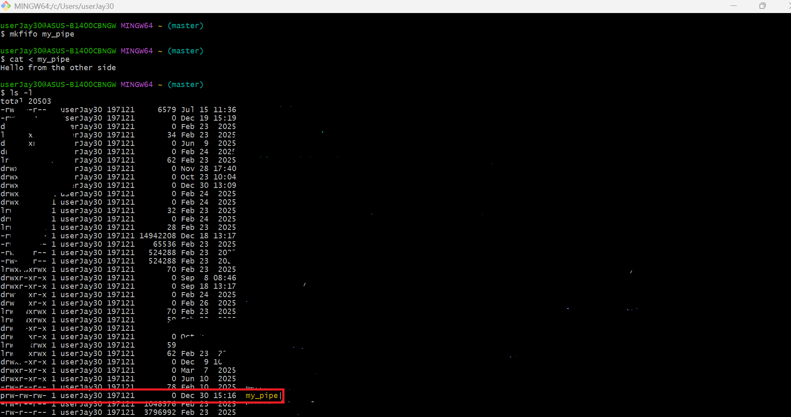
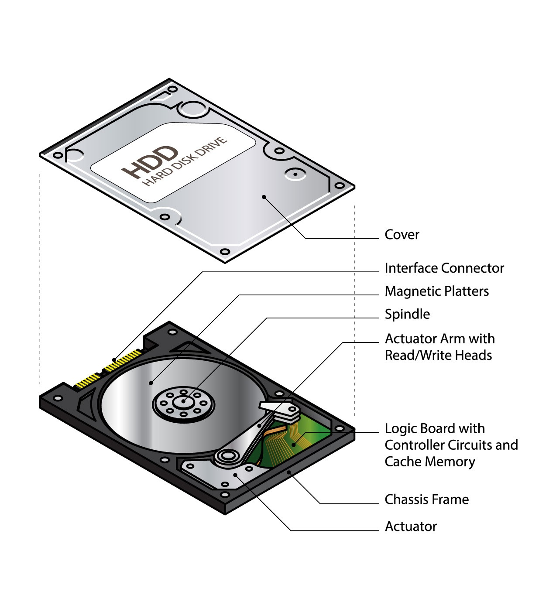

# CH24 -- named pipe
## objectives
You will learn how to 

    + use named pipe

## CH24-1 -- rationales
When you create a named pipe successfully with `mkfifo`, 

you will find that there is a file named `{pipe-name}` (where `{pipe-name}` is a pipe name you specified) under current working directory,

so when you list files using `ls -l`, you will see a file named `{pipe-name}` and it starts with `p` in its permission field.

see the redbox hightlighted in this figure.



The file is stored in cached memory rather than HDD (stands for hard disk drive).

Thus, the receiever can immediately reads the data in the named pipe once after one writes the data to (as it reads much faster than reading data from HDD )

> [!NOTE]
> Reading data from HDD is much slower than read data from cached memory 
> 
> since actuator arms needs to spin `Read Head` 360 degree to seek the data (which takes `seed time`) and more which takes lots of time.  
>
> 
>
> for more details, see [rationale of reading data from HDD](https://gemini.google.com/share/2002ef5abe2d)

However, it has `64KB`, so that when the sender writes large data over than 64MB, 

then it will be unable to write the data until the receiever successfully read it (as it is stored in cached memory and there is a small amount of space in cached memory). 

Otherwise, sender will get stuck.

Additionally, it has other limitations.

    + read once: When the data is read, the data dispears though lots of receiever can read it.
    + blocking: the receiever will wait the data (and thus can't do other thing) until there is a sender writes data to.

You can think it of TCP/IP connection.

## CH24-2 -- usage
To create a named pipe, use `mkfifo` with pipe name.

syntax:

```
mkfifo {pipe-name}
```

where 

```
{pipe-name}: pipe name. Can be an identifier.
```

Then you can read the data using `<` (redirection input symbol)

```
cat < {pipe-name}
```

also you can write the data using `>` (redirection output symbol)

```
cat > {pipe-name}
```

## Examples
### Example 1
This example illustrates how other terminal reads data that is sent from a sender.

I first open terminal A (receiever) and then create a pipe named `my_pipe`

Terminal A (receiever):

```
userJay30@ASUS-B1400CBNGW MINGW64 ~ (master)
$ mkfifo my_pipe
```

Next, terminal A listens to data from named pipe `my_pipe`, until there is a sender writes the data to, using the following command

```
userJay30@ASUS-B1400CBNGW MINGW64 ~ (master)
$ cat < my_pipe
```

I open terminal B (sender) and then writes `Hello from the other side` message to the named pipe `my_pipe` using the following command

```
userJay30@ASUS-B1400CBNGW MINGW64 ~ (master)
$ echo "Hello from the other side" > my_pipe

```

After that, terminal A (receiever) will immediately reads data from the named pipe and echo the data it receives (here is, `Hello from the other side`).

I use `ls -l` to list all files and directory, I see a file named `my_pipe` and it starts with `p` in its permission field.

see the redbox hightlighted in this figure.


Lastly, I execute `remove my_pipe` to remove the named pipe `my_pipe`

The final result:

Terminal A (receiever):

```
userJay30@ASUS-B1400CBNGW MINGW64 ~ (master)
$ mkfifo my_pipe

userJay30@ASUS-B1400CBNGW MINGW64 ~ (master)
$ cat < my_pipe
Hello from the other side

userJay30@ASUS-B1400CBNGW MINGW64 ~ (master)
$ ls -l
total 20503
prw-rw-rw- 1 userJay30 197121        0 Dec 30 15:16  my_pipe|

# ... other files and directories omitted

userJay30@ASUS-B1400CBNGW MINGW64 ~ (master)
$ rm my_pipe

```

Terminal B (sender):

```
userJay30@ASUS-B1400CBNGW MINGW64 ~ (master)
$ echo "Hello from the other side" > my_pipe

```